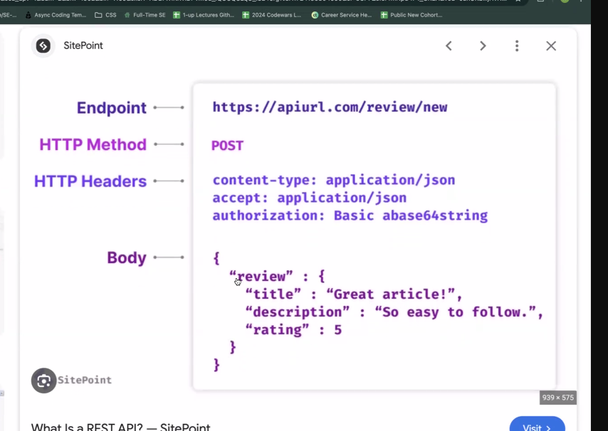
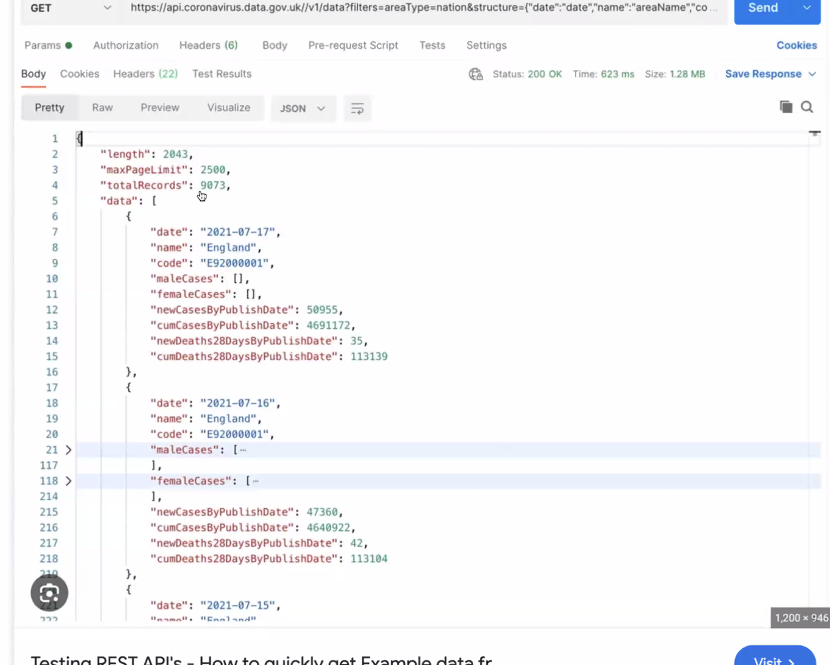

# Web Fundamentals 

## Client- Server Model
### Server is what we focus , client is the front end 

## Web Architecture 
- Monolithic v/s micro service 
  -  Mono= single unified codebase
      -  Air Bnb, Facebook( early days, is now micro) , E-commerce 
##### SOA Service Orientated Architecture 
  - Enterprise Bus Service is middle man between 

## Micro-service Arch.

  - breaks down apps into smaller more granular services 
  - Decentralized , independent , requires sophistic managenet]

1. REST (Rep State Transfer) - CRUD functions - Rest API = creating, updating and deleting a user
2.Graph QL- only load specifi data 
3.   gRPC(Google Remote Protocol) - not used much 
4. Websocket - example chat during youtube video 

# REST API 

Predefined data = 
- All data must be loaded not just what front asks for 
  
# API 
##### is the acronym for application programming interface — a software intermediary that allows two applications to talk to each other.

## Virtual Environment 
 - mange dependancies so can go back and use same tools as before 
 - 